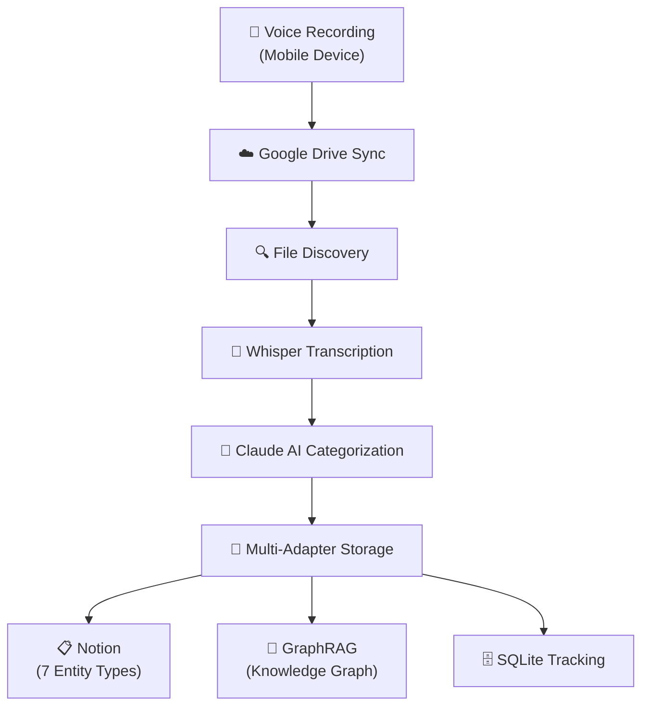

# Voice Task Manager

A modern Python package that automatically converts voice recordings into organized Notion tasks with intelligent categorization. Features multi-adapter storage (Notion + GraphRAG), comprehensive testing, and a clean architecture following Python best practices.

## 🚀 Quick Start

```bash
# Install UV (recommended - faster and more reliable than pip)
curl -LsSf https://astral.sh/uv/install.sh | sh

# Clone and setup
git clone <repository-url>
cd task-management

# Create virtual environment and install
uv venv
source .venv/bin/activate
uv pip install -e ".[dev,mcp,all]"

# Configure environment
cp .env.example .env
# Edit .env with your API keys

# Run tests to verify setup
pytest tests/unit/

# Process voice files
python -m voice_task_manager.core.processor
```

## 🎤 Voice to Task Pipeline



## ✨ Key Features

### 🏗️ Modern Architecture
- **Clean Package Structure** - `src/` layout following Python best practices
- **Multi-Adapter Pattern** - Pluggable storage backends (Notion, GraphRAG)
- **Comprehensive Testing** - Unit, integration, and E2E test suites
- **UV Package Manager** - Fast, reliable dependency management

### 🤖 Intelligent Processing
- **Claude AI Integration** - Smart categorization into projects, areas, and contexts
- **Whisper Transcription** - High-accuracy voice-to-text conversion
- **Duplicate Prevention** - SQLite tracking ensures no duplicate processing
- **Error Recovery** - Robust error handling and retry logic

### 📋 Notion Integration
- **7 Entity Types** - Tasks, Projects, Areas, Goals, Notes, Events, References
- **PARA Method** - Automatic organization following productivity best practices
- **Full CRUD Operations** - Create, read, update, delete for all entities
- **MCP Server** - 9 tools for comprehensive Notion interaction

### 🧠 GraphRAG Integration
- **Knowledge Graph** - Neo4j-based relationship mapping
- **Semantic Search** - Find related tasks and concepts
- **Context Preservation** - Maintains relationships between entities
- **Future-Ready** - Prepared for advanced AI features

## 📁 Project Structure

```
task-management/
├── src/voice_task_manager/     # Main package (following src layout)
│   ├── adapters/              # Storage adapters (Notion, GraphRAG)
│   ├── core/                  # Core business logic
│   ├── integrations/          # External services (Drive, Whisper, Notion)
│   ├── models/                # Data models for all entities
│   ├── processors/            # AI processing (Claude)
│   └── utils/                 # Utility functions
├── tests/                     # Comprehensive test suites
│   ├── unit/                  # Unit tests for components
│   ├── integration/           # API integration tests
│   └── e2e/                   # End-to-end workflow tests
├── scripts/                   # Utility scripts (organized)
│   ├── debug/                 # Debugging tools
│   ├── analysis/              # Performance analysis
│   └── maintenance/           # System maintenance
└── docs/                      # Complete documentation
```

## 🔧 Installation & Setup

### Prerequisites
- Python 3.10+
- UV package manager (recommended) or pip
- API Keys: OpenAI, Notion, Google Drive credentials
- Optional: Neo4j for GraphRAG features

### Detailed Setup

1. **Install UV (Recommended)**
   ```bash
   curl -LsSf https://astral.sh/uv/install.sh | sh
   ```

2. **Clone and Install**
   ```bash
   git clone <repository-url>
   cd task-management
   
   # Create virtual environment
   uv venv
   source .venv/bin/activate
   
   # Install with all features
   uv pip install -e ".[dev,mcp,all]"
   ```

3. **Configure Environment**
   ```bash
   cp .env.example .env
   ```
   
   Edit `.env` with your credentials:
   ```env
   # Core APIs
   OPENAI_API_KEY=sk-...
   NOTION_TOKEN=secret_...
   NOTION_TASKS_DB=...
   NOTION_PROJECTS_DB=...
   NOTION_AREAS_DB=...
   # ... other Notion DBs
   
   # Google Drive
   GOOGLE_DRIVE_FOLDER_ID=...
   
   # GraphRAG (Optional)
   NEO4J_URI=bolt://localhost:7687
   NEO4J_USER=neo4j
   NEO4J_PASSWORD=...
   
   # Claude API
   ANTHROPIC_API_KEY=sk-ant-...
   ```

4. **Verify Installation**
   ```bash
   # Run tests
   pytest tests/unit/ -v
   
   # Check imports
   python -c "from voice_task_manager.core.processor import VoiceProcessor; print('✅ Setup complete!')"
   ```

## 🎛️ MCP Inspector Dashboard

Interactive visual testing tool for the Notion MCP server:

```bash
# Start MCP Inspector
npx @modelcontextprotocol/inspector notion_mcp_server.py

# Or use the convenience script
./scripts/start-mcp-inspector.sh
```

**Available Tools:**
- `create-task`, `delete-task` - Task management
- `create-project`, `create-area`, `create-goal` - PARA entities
- `create-note`, `create-event`, `create-reference` - Content entities
- `server-info` - Server diagnostics

## 🧪 Testing

```bash
# Run all tests
pytest

# Run specific test suites
pytest tests/unit/              # Fast unit tests
pytest tests/integration/       # API integration tests
pytest tests/e2e/              # Full workflow tests

# Run with coverage
pytest --cov=voice_task_manager --cov-report=html

# Run specific test
pytest tests/unit/test_adapters.py::TestTaskData -v
```

## 📊 Performance

- **Database Operations**: ~0.2ms per query
- **Transcription**: ~5-10s per minute of audio
- **Task Creation**: <1s including categorization
- **Memory Usage**: <100MB for typical workload
- **Test Coverage**: 135+ passing tests

## 💡 Usage Examples

### Simple Voice Commands
```
"Create a task to review the quarterly reports"
"Add a note about the team meeting decisions"
"New project for the mobile app redesign"
"Schedule dentist appointment for next Tuesday"
```

### Complex Commands (Claude processes)
```
"Set up a comprehensive testing strategy for the new API endpoints"
"Create a project plan for migrating to microservices"
"Research and document best practices for GraphQL implementation"
```

## 🤝 Contributing

1. **Follow Python Best Practices**
   - Use `src/` layout
   - Write comprehensive tests
   - Update documentation
   - Run `ruff` and `black` before committing

2. **Testing Requirements**
   - Add unit tests for new features
   - Update integration tests for API changes
   - Maintain >80% test coverage

3. **Documentation**
   - Update relevant `.md` files
   - Add docstrings to new functions
   - Update API reference if needed

## 📚 Documentation

- **[Project Structure](docs/operations/PROJECT_STRUCTURE.md)** - Detailed code organization
- **[API Reference](docs/reference/api_reference.md)** - Complete API documentation
- **[Setup Guides](docs/guides/setup/)** - Detailed setup instructions
- **[Architecture](docs/architecture/)** - System design documentation
- **[MCP Server Guide](docs/mcp-server-guide.md)** - MCP server details

## 🔮 Roadmap

- [ ] Fix GraphRAG adapter list/dict issue
- [ ] Add async processing support
- [ ] Implement real-time webhook processing
- [ ] Add web dashboard for monitoring
- [ ] Support for more voice input sources
- [ ] Enhanced AI categorization with fine-tuning

## 📄 License

[Your License Here]

---

*A modern, well-architected Python package for voice-driven task management with AI-powered categorization and multi-backend storage.*