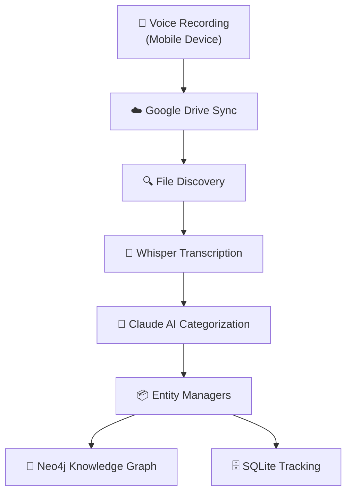

# Voice Task Manager - Complete Documentation

**Version**: 2.0  
**Last Updated**: 2025-08-23

## Table of Contents

1. [Overview](#overview)
2. [Quick Start](#quick-start)
3. [Architecture](#architecture)
4. [User Guide](#user-guide)
5. [Command Reference](#command-reference)
6. [System Components](#system-components)
7. [Configuration](#configuration)
8. [Development](#development)
9. [Troubleshooting](#troubleshooting)
10. [API Reference](#api-reference)

---

## Overview

Voice Task Manager is a modern Python package that automatically converts voice recordings into organized tasks using GraphRAG/Neo4j knowledge graphs. Simply record a voice note on your mobile device, and within 5 minutes it will be transcribed, intelligently categorized, and stored in your knowledge graph.

### Key Features

- 🎤 **Voice to Task**: Automatic conversion of voice recordings to structured tasks
- 🧠 **AI Categorization**: Claude AI intelligently assigns projects, areas, and contexts
- 📊 **GraphRAG Storage**: Pure Neo4j knowledge graph for relationship-based task management
- 🔄 **Multi-Task Processing**: Extract multiple tasks from a single recording
- 🔔 **Smart Notifications**: Desktop and email alerts for processing status
- 🛠️ **Modern Python**: Clean package structure with comprehensive testing

### Technology Stack

- **Voice Processing**: OpenAI Whisper API for transcription
- **AI Analysis**: Claude AI with MCP (Model Context Protocol) for categorization
- **Storage**: Neo4j/GraphRAG for knowledge graph, SQLite for tracking
- **Integration**: Google Drive API for voice file discovery
- **Package Management**: UV for fast, reliable dependency resolution

---

## Quick Start

### Installation

```bash
# Install UV (recommended - faster than pip)
curl -LsSf https://astral.sh/uv/install.sh | sh

# Clone repository
git clone <repository-url>
cd task-management

# Create virtual environment and install
uv venv
source .venv/bin/activate
uv pip install -e ".[dev,mcp,all]"

# Configure environment
cp config/env.template .env
# Edit .env with your API keys

# Run tests to verify setup
pytest tests/unit/

# Start processing voice files
vtm process
```

### Basic Workflow

1. **Record**: Use Voice Recorder Pro or Just Press Record on your phone
2. **Sync**: Files automatically sync to Google Drive
3. **Process**: System checks every 5 minutes (or run `vtm process` manually)
4. **Review**: Tasks appear in your Neo4j knowledge graph

---

## Architecture

### System Flow



### Package Structure

```
task-management/
├── src/voice_task_manager/      # Main package
│   ├── adapters/               # Storage adapters (GraphRAG)
│   ├── core/                   # Core business logic
│   ├── entities/               # Entity managers (Task, Project, Area)
│   ├── integrations/           # External services (Drive, Whisper)
│   ├── processors/             # AI processing (Claude)
│   ├── services/               # Background services
│   └── utils/                  # Utilities and helpers
├── tests/                      # Comprehensive test suite
│   ├── unit/                   # Unit tests
│   ├── integration/            # Integration tests
│   └── e2e/                    # End-to-end tests
├── scripts/                    # Utility scripts
│   ├── debug/                  # Debugging tools
│   ├── analysis/               # Analytics and reporting
│   └── maintenance/            # System maintenance
└── docs/archive/               # Additional documentation
```

### Service Architecture

The system can run as either a cron job or a long-running daemon:

#### Daemon Mode (Recommended)

```
┌──────────────────────────────────────────────────────────┐
│                 Voice Processing Service                  │
├──────────────────────────────────────────────────────────┤
│  ┌────────────────────┐      ┌─────────────────────┐   │
│  │ VoiceProcessingDaemon│      │ ClaudeSessionManager│   │
│  │  (Main Thread)      │ ────▶│  (OAuth Monitor)    │   │
│  └────────┬───────────┘      └─────────────────────┘   │
│           ▼                                              │
│  ┌────────────────────┐                                │
│  │  Processing Loop    │                                │
│  │  (5 min intervals) │                                │
│  └────────┬───────────┘                                │
│           ▼                                              │
│  ┌────────────────────┐                                │
│  │ VoiceProcessorV2    │                                │
│  │ ├─ Drive Discovery │                                │
│  │ ├─ Whisper Trans.  │                                │
│  │ ├─ Claude AI       │                                │
│  │ └─ Entity Managers │                                │
│  └────────────────────┘                                │
└──────────────────────────────────────────────────────────┘
```

---

## User Guide

### Recording Best Practices

#### Single Task
```
"Call the dentist to schedule my cleaning appointment"
```

#### Multiple Tasks
```
"I need to call the plumber about the kitchen sink, 
schedule my dentist appointment, 
and pick up groceries on the way home"
```
→ Creates 3 separate tasks with appropriate categorization

#### Task with Context
```
"For the Sleep Worlds project, I need to set up 
the Android emulator for testing the Adapty migration"
```
→ Automatically assigns to "Sleep Worlds" project

#### Priority Tasks
```
"Urgent: Submit the tax documents by end of day"
```
→ Sets high priority based on "urgent" keyword

### Task Organization

The system uses the PARA methodology:
- **Projects**: Specific outcomes with deadlines
- **Areas**: Ongoing responsibilities (Work, House, Health)
- **Resources**: Reference materials (created as Notes)
- **Archive**: Completed items

Tasks are automatically categorized with:
- Project assignment based on context
- Area assignment based on domain
- Context tags (@home, @office, @computer, @phone)
- Priority levels (Low, Medium, High, Urgent)

---

## Command Reference

### Core Commands

```bash
# Process voice files
vtm process [--dry-run] [--verbose]

# Analyze processing history
vtm analyze [--stats] [--today] [--errors] [--export json|csv]

# Manage processed files
vtm cleanup [--list] [--guide] [--auto] [--dry-run]

# System health check
vtm status [--detailed] [--json]

# Notification management
vtm notify [--test] [--status] [--summary] [--history]

# Configuration setup
vtm setup [--cron] [--validate] [--reset]

# Archive management
vtm archive [--list] [--mark ID] [--auto] [--status]

# Service daemon control
vtm service [start|stop|restart|status] [--interval 300]
```

### Environment Variables

Required configuration in `.env`:

```bash
# Core Services
OPENAI_API_KEY=sk-...
GOOGLE_DRIVE_FOLDER_ID=...
ANTHROPIC_API_KEY=sk-ant-...  # Optional if using Claude OAuth

# GraphRAG/Neo4j
NEO4J_URI=bolt://localhost:7687
NEO4J_USER=neo4j
NEO4J_PASSWORD=your_password

# Features
USE_REAL_MCP=true
USE_CLAUDE_PROCESSOR=true
CLEANUP_PROCESSED_FILES=true

# Notifications (Optional)
NOTIFICATIONS_EMAIL_ENABLED=true
SMTP_SERVER=smtp.gmail.com
SMTP_USER=your-email@gmail.com
NOTIFICATION_EMAIL=your-email@gmail.com
```

---

## System Components

### 1. Entity Managers

Dedicated managers for each entity type with schema validation:

```python
entities/
├── base_manager.py      # Base class with common functionality
├── task_manager.py      # Task creation and management
├── project_manager.py   # Project hierarchy management
├── area_manager.py      # Area of responsibility management
├── goal_manager.py      # Goal tracking
└── note_manager.py      # Reference note management
```

### 2. GraphRAG Adapter

The main interface to Neo4j knowledge graph:

- **Entity Creation**: Tasks, Projects, Areas, Goals, Notes
- **Relationship Management**: BELONGS_TO, RELATES_TO, CONTRIBUTES_TO
- **Embedding Support**: Automatic semantic search capabilities
- **MCP Integration**: Uses agent-db MCP server for operations

### 3. Claude Processor

Intelligent AI categorization using Claude with MCP access:

- Extracts multiple tasks from single recordings
- Assigns appropriate projects and areas
- Determines task priority and contexts
- Handles complex natural language understanding

### 4. Voice Processing Pipeline

Complete workflow from recording to task:

1. **Discovery**: Find new audio files in Google Drive
2. **Download**: Retrieve files for processing
3. **Transcription**: Convert audio to text using Whisper
4. **Analysis**: Claude AI extracts and categorizes tasks
5. **Storage**: Create entities in GraphRAG with relationships
6. **Cleanup**: Move processed files to archive

### 5. Service Daemon

Long-running service for continuous processing:

- **OAuth Management**: Maintains Claude authentication
- **Health Monitoring**: Tracks statistics and errors
- **Resource Control**: Configurable intervals and limits
- **Systemd Integration**: Auto-start on boot

---

## Configuration

### Claude Authentication

The system uses Claude Code CLI for OAuth authentication:

```bash
# Initial setup
claude login

# Generate long-lived token for automation
claude setup-token
export CLAUDE_CODE_OAUTH_TOKEN="Claude-..."

# Test authentication
python scripts/debug/test_claude_auth.py
```

**Important**: Always use the native binary at `/home/mike/.claude/local/claude`

### MCP Configuration

The `.mcp.json` file configures Model Context Protocol servers:

```json
{
  "servers": {
    "agent-db": {
      "command": "uv",
      "args": ["run", "--directory", "/path/to/project-agents", "project-agents-mcp"],
      "env": {
        "NEO4J_URI": "bolt://localhost:7687",
        "NEO4J_USER": "neo4j",
        "NEO4J_PASSWORD": "your_password"
      }
    }
  }
}
```

### Automation Setup

#### Cron Job
```bash
# Setup cron for every 5 minutes
vtm setup --cron

# Or manually add to crontab
*/5 * * * * /path/to/vtm-cron-wrapper.sh
```

#### Systemd Service
```bash
# Install service
sudo cp scripts/services/voice-processing.service /etc/systemd/system/
sudo systemctl enable voice-processing
sudo systemctl start voice-processing

# Check status
vtm service status
```

---

## Development

### Setting Up Development Environment

```bash
# Clone and setup
git clone <repository>
cd task-management

# Use UV for development
uv venv
source .venv/bin/activate
uv pip install -e ".[dev,mcp,all]"

# Run tests
pytest                    # All tests
pytest tests/unit/        # Unit tests only
pytest tests/integration/ # Integration tests
pytest tests/e2e/        # End-to-end tests

# Code quality
black src/ tests/        # Format code
ruff check src/ tests/   # Lint code
mypy src/               # Type checking
```

### Project Standards

- **Package Manager**: UV exclusively (not pip/venv)
- **Code Style**: Black formatter, Ruff linter
- **Type Hints**: Full annotations, validated with mypy
- **Testing**: Pytest with comprehensive coverage
- **Documentation**: Inline docstrings + markdown docs

### Adding New Features

1. Create feature branch: `git checkout -b feature/your-feature`
2. Implement with tests
3. Update documentation
4. Run quality checks: `black`, `ruff`, `mypy`, `pytest`
5. Create PR: `gh pr create`

---

## Troubleshooting

### Common Issues

#### Tasks Not Creating

```bash
# Check service status
vtm service status

# Review logs
tail -f logs/voice-automation.log
tail -f logs/voice-errors.log

# Test manually
vtm process --verbose

# Verify MCP connection
USE_REAL_MCP=true python scripts/debug/test_mcp_connection.py
```

#### Authentication Issues

```bash
# Check Claude auth
claude login

# Verify credentials exist
ls -la ~/.claude/.credentials.json

# Test with debug script
python scripts/debug/test_claude_auth.py
```

#### Poor Transcription

- Speak clearly with minimal background noise
- Keep recordings under 2 minutes
- Use high-quality recording app
- Avoid multiple speakers

#### Wrong Categorization

- Be specific about project names
- Mention area/context explicitly
- Check existing projects in Neo4j
- Review Claude's reasoning in logs

### Debug Scripts

```bash
scripts/debug/
├── test_claude_auth.py           # Test Claude authentication
├── test_mcp_connection.py        # Verify MCP server connection
├── verify_neo4j_connection.py    # Check Neo4j connectivity
├── test_entity_managers.py       # Test entity creation
├── list_recent_tasks.py          # Show recently created tasks
└── find_concrete_blocks_task.py  # Debug specific task issues
```

### Log Files

```bash
logs/
├── voice-automation.log    # Main processing log
├── voice-errors.log       # Error details
├── voice-service.log      # Daemon service log
├── cron-voice.log        # Cron execution log
└── claude-responses.log   # Claude AI responses
```

---

## API Reference

### GraphRAG Adapter

```python
from voice_task_manager.adapters import GraphRAGTaskAdapter

adapter = GraphRAGTaskAdapter()

# Create task with relationships
task_id = adapter.create_task(TaskData(
    name="Call dentist",
    description="Schedule cleaning appointment",
    project_name="Health Maintenance",
    area_name="Health"
))

# Query entities
context = adapter.get_categorization_context()
```

### Entity Managers

```python
from voice_task_manager.entities import TaskManager, ProjectManager

# Create project
project_manager = ProjectManager(adapter)
project_id = project_manager.create(
    name="Home Renovation",
    description="Kitchen and bathroom updates",
    area_name="House"
)

# Create task with project
task_manager = TaskManager(adapter)
task_id = task_manager.create(
    task_data=TaskData(...),
    project_id=project_id
)
```

### Voice Processor

```python
from voice_task_manager.core.processor import VoiceProcessorV2

processor = VoiceProcessorV2()
results = processor.process_all_files(dry_run=False)

# Results include:
# - processed: number of files processed
# - success: overall success status
# - errors: list of any errors
# - run_summary: statistics
```

### MCP Operations

The system uses MCP tools for GraphRAG operations:

- `mcp__agent-db__create_entities`: Create entities with embeddings
- `mcp__agent-db__query_natural_language`: Natural language queries
- `mcp__agent-db__query_with_cypher`: Direct Cypher queries
- `mcp__agent-db__find_similar_entities`: Semantic search

---

## Appendix

### GraphRAG Schema

```
Nodes:
- TASK: Individual tasks with description, status, priority
- PROJECT: Time-bound initiatives with goals
- AREA: Ongoing areas of responsibility
- GOAL: High-level objectives
- NOTE: Reference materials and ideas

Relationships:
- BELONGS_TO: Task → Project, Project → Area
- RELATES_TO: Cross-entity relationships
- CONTRIBUTES_TO: Task/Project → Goal
- DEPENDS_ON: Task dependencies
```

### Voice Command Examples

✅ **Good Examples**:
- "For the Sleep Worlds project, implement user authentication"
- "Call dentist tomorrow morning to schedule cleaning"
- "Buy milk, eggs, and bread at grocery store"
- "Urgent: Submit expense report before Friday"

❌ **Avoid**:
- Vague requests: "That thing I mentioned yesterday"
- Too many details: Long explanations
- Background conversations
- Multiple languages in one recording

### Performance Metrics

- **Processing Time**: ~30-60 seconds per voice file
- **Transcription Accuracy**: 99%+ with Whisper
- **Categorization Success**: 95%+ with Claude AI
- **Entity Creation**: < 5 seconds per entity
- **Service Memory**: ~200MB resident
- **CPU Usage**: < 5% between processing cycles

---

**For additional documentation, see the `docs/archive/` directory.**