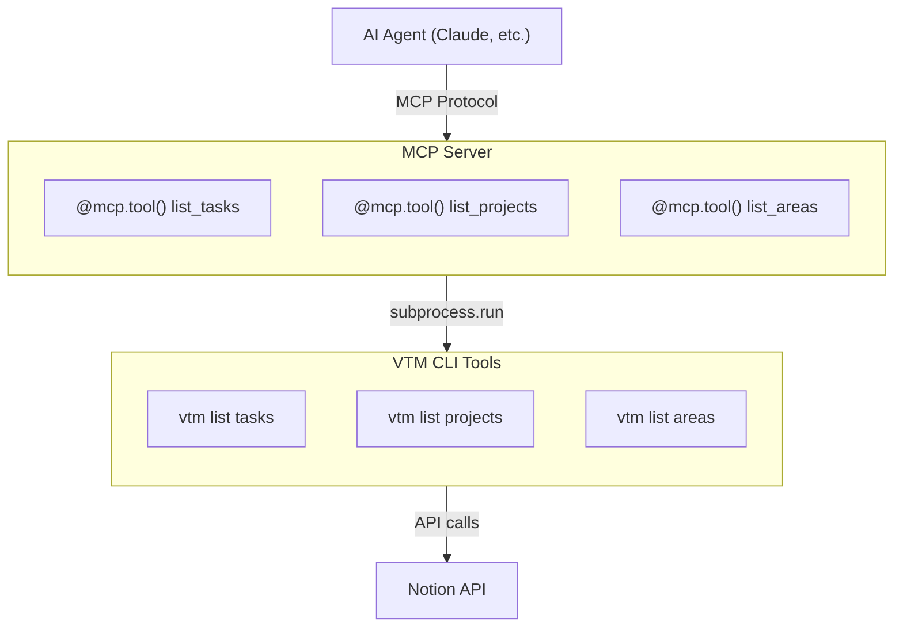

# MCP Server Design for Notion CLI Tools

## Overview

This document outlines the recommended architecture for creating a Model Context Protocol (MCP) server that exposes the Voice Task Management Notion CLI tools to AI agents. The design follows 2025 MCP best practices and leverages existing CLI infrastructure.

## Research Summary

### MCP Server Design Patterns (2025)

Based on research of current MCP implementations, the following patterns are recommended:

1. **Intentional Tool Design**: Define focused toolsets rather than mapping every API endpoint
2. **Domain-Driven Design**: Clear domain boundaries with repository abstractions
3. **CLI Integration**: Subprocess-based approach for wrapping existing command-line tools
4. **Security & Compliance**: Comprehensive input validation and error handling
5. **Documentation & Versioning**: Clear API references and structured schemas

### FastMCP Framework

The official Python SDK's FastMCP framework provides:
- Decorator-based API for rapid development
- Automatic schema generation and validation
- Built-in transport support (stdio, HTTP, SSE)
- Structured output capabilities
- Authentication and authorization support

## Architecture Design

### Core Components



### Implementation Structure

```python
from mcp.server.fastmcp import FastMCP
import subprocess
import json
from typing import Dict, List, Any, Optional

mcp = FastMCP("Notion Task Management")

@mcp.tool()
async def list_tasks(
    area: Optional[str] = None,
    project: Optional[str] = None, 
    status: Optional[str] = None,
    format: str = "table"
) -> Dict[str, Any]:
    """List tasks from Notion with optional filters."""
    
@mcp.tool()
async def list_projects(format: str = "table") -> Dict[str, Any]:
    """List all projects from Notion."""
    
@mcp.tool()
async def list_areas(format: str = "table") -> Dict[str, Any]:
    """List all areas from Notion."""
```

## Transport Options

### Development
- **stdio transport**: Local testing with MCP Inspector
- Direct subprocess execution for debugging

### Production
- **Streamable HTTP**: Scalable deployment for multiple clients
- Session management and state persistence
- Authentication support via OAuth 2.1

## Design Principles Applied

### 1. Intentional Tool Design
- **Limited Scope**: Three focused tools matching core CLI commands
- **Higher-Level Functions**: Expose business operations, not technical details
- **Clear Separation**: Each tool has single responsibility

### 2. Structured Output Support
- **JSON Format**: Machine-readable structured data for AI processing
- **Table Format**: Human-readable fallback for debugging
- **Schema Validation**: Automatic validation via MCP framework

### 3. Security & Error Handling
- **Input Validation**: Sanitize all parameters before subprocess calls
- **Error Propagation**: Proper error handling from CLI to MCP client
- **Subprocess Security**: Use secure subprocess execution patterns

### 4. Backwards Compatibility
- **CLI Preservation**: No changes to existing CLI infrastructure
- **Parameter Mapping**: Direct mapping of MCP parameters to CLI arguments
- **Output Compatibility**: Support both structured and text outputs

## Benefits

### Protocol Standardization
- **Universal Compatibility**: Works with any MCP client (Claude Desktop, VS Code, etc.)
- **Discovery Patterns**: Standardized tool discovery and execution
- **Vendor Independence**: Avoid lock-in to specific AI platforms

### Development Efficiency
- **Code Reuse**: Leverage existing CLI investment
- **Minimal Changes**: No business logic refactoring required
- **Rapid Deployment**: FastMCP enables quick server creation

### Scalability
- **Multi-Client Support**: HTTP deployment supports concurrent access
- **Session Management**: Framework handles connection lifecycle
- **Authentication Ready**: OAuth support for protected resources

## Implementation Phases

### Phase 1: Basic MCP Server
1. Create FastMCP server with three core tools
2. Implement subprocess wrappers for CLI commands
3. Add basic error handling and validation
4. Test with MCP Inspector

### Phase 2: Enhanced Features
1. Add structured output schemas
2. Implement comprehensive error handling
3. Add logging and monitoring capabilities
4. Create development and production configurations

### Phase 3: Production Deployment
1. Configure Streamable HTTP transport
2. Add authentication and authorization
3. Implement monitoring and metrics
4. Deploy for multi-client access

## Security Considerations

### Input Validation
- Sanitize all user inputs before CLI execution
- Validate parameter types and ranges
- Implement command injection prevention

### Process Isolation
- Use secure subprocess execution
- Limit command execution scope
- Implement proper timeout handling

### Authentication
- OAuth 2.1 support for protected resources
- Token validation and refresh
- Scope-based access control

## Testing Strategy

### Development Testing
```bash
# Install MCP development tools
uv add "mcp[cli]"

# Test server with MCP Inspector
uv run mcp dev notion_mcp_server.py

# Install in Claude Desktop for integration testing
uv run mcp install notion_mcp_server.py
```

### Production Testing
- HTTP endpoint testing
- Load testing for concurrent clients
- Authentication flow validation
- Error handling verification

## Future Enhancements

### Additional Tools
- Task creation and modification
- Project and area management
- Voice file processing integration
- Automated categorization

### Advanced Features
- Real-time updates via notifications
- Batch operations for efficiency
- Custom query language support
- Integration with other productivity tools

## References

- [MCP Python SDK](https://github.com/modelcontextprotocol/python-sdk)
- [FastMCP Documentation](https://github.com/jlowin/fastmcp)
- [MCP Specification](https://spec.modelcontextprotocol.io/)
- [MCP Best Practices 2025](https://www.marktechpost.com/2025/07/23/7-mcp-server-best-practices-for-scalable-ai-integrations-in-2025/)

*Last Updated: 2025-07-26*