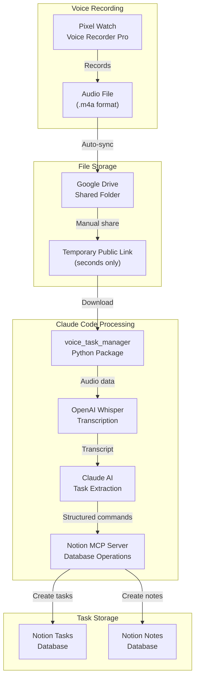
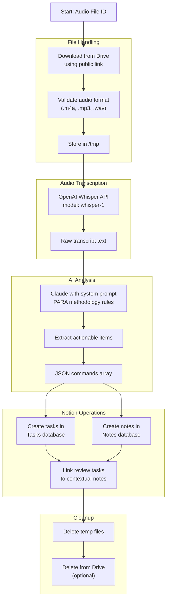

# Voice Note Processing Flow

## Current Architecture Overview

This documents the **current working system** for processing voice notes from recording to Notion task creation.

## System Flow



## Detailed Processing Pipeline



## Command Structure

The system processes voice commands into structured JSON:

```json
{
  "commands": [
    {
      "type": "task.create",
      "data": {
        "name": "Review quarterly metrics",
        "status": "Inbox",
        "priority": "Medium",
        "contexts": ["@computer", "@work"],
        "project": "Q4 Planning"
      }
    },
    {
      "type": "note.create", 
      "data": {
        "title": "Meeting notes - Q4 planning",
        "content": "Discussed budget allocation...",
        "tags": ["meeting", "planning"]
      }
    }
  ]
}
```

## Current Implementation

### Technology Stack
- **Python Package**: `voice_task_manager` with CLI interface
- **Transcription**: OpenAI Whisper API
- **AI Processing**: Claude 3.5 Sonnet via Anthropic API
- **Database**: Notion via MCP server integration
- **File Storage**: Google Drive with temporary public sharing

### Key Components

1. **Voice Task Manager** (`src/voice_task_manager/`)
   - Command-line interface for processing
   - Integration with all APIs
   - Error handling and logging

2. **Notion MCP Server** (`notion_mcp_server.py`)
   - Handles all Notion database operations
   - CRUD operations for tasks, notes, projects
   - Relationship management

3. **Processing Scripts** (`scripts/`)
   - Manual processing utilities
   - Cleanup and maintenance tools

### Usage

```bash
# Process a single voice file
python -m voice_task_manager.cli process-voice-file \
  --file-id "GOOGLE_DRIVE_FILE_ID" \
  --delete-after

# Check system status
python -m voice_task_manager.cli check-system-health
```

## Limitations & Considerations

### Current Limitations
- **Manual trigger**: Requires manual execution per voice file
- **Public sharing**: Files must be temporarily made public
- **No automation**: No automated folder monitoring

### Security Notes
- Audio files are public for seconds only during processing
- Files deleted immediately after processing
- API keys stored in environment variables

### Future Enhancements
- Automated folder monitoring
- Private Google Drive API integration
- Real-time processing pipeline
- Web interface for management

---

*This documentation reflects the current working system as of July 2025. The system has evolved from Windmill-based workflows to a direct Python implementation with MCP server integration.*