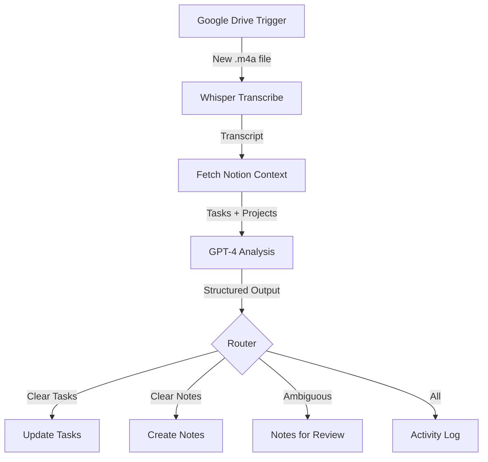

# Voice Task Management Implementation Guide

## Phase 1: Voice Recording Setup (Pixel Watch → Google Drive)

### Option 1: Using Google Keep (Easiest)
1. **On Pixel Watch**:
   - Install Google Keep from Play Store
   - Open Keep → Tap microphone icon
   - Records voice note with automatic transcription
   - Syncs to Google Keep automatically

2. **In Google Drive**:
   - Keep notes appear in Drive under "Google Keep" folder
   - Access via Keep API or export

### Option 2: Using Voice Recorder + Manual Sync
1. **On Pixel Watch**:
   - Use built-in Recorder app
   - Files save locally to watch

2. **On Paired Phone**:
   - Install "Wear OS" app
   - Files don't auto-sync from Recorder app
   - Need workaround (see Option 3)

### Option 3: Using Tasker + AutoWear (Most Flexible)
1. **Setup**:
   - Install Tasker on phone ($3.49)
   - Install AutoWear plugin ($1.99)
   - Install "Wear Recorder" or similar on watch

2. **Tasker Profile**:
   ```
   Profile: Voice Recording Sync
   Trigger: AutoWear → File Received
   Task:
     1. Move File → To: /Download/VoiceNotes/
     2. Google Drive Upload → File: %awfile
     3. Delete Local File (optional)
   ```

### Option 4: Voice Recorder Pro (Recommended)
- **Easy Voice Recorder Pro** ($3.99): 
  - Auto-uploads to Google Drive
  - High quality M4A recordings
  - Background recording
  - Reliable sync
- **Wear Voice Recorder** (Free):
  - Basic functionality
  - Manual upload required

## Phase 2: n8n Workflow Setup

### Prerequisites
```bash
# Create n8n instance (choose one):

# Option 1: n8n Cloud (easiest)
# Sign up at https://n8n.cloud

# Option 2: Self-hosted with Docker
docker run -it --rm \
  --name n8n \
  -p 5678:5678 \
  -v ~/.n8n:/home/node/.n8n \
  n8nio/n8n

# Option 3: Railway/Render deployment
# Use their n8n templates
```

### Required Credentials
1. **Google Drive**:
   - Go to Google Cloud Console
   - Create new project
   - Enable Drive API
   - Create OAuth2 credentials
   - Download JSON

2. **OpenAI**:
   - Get API key from platform.openai.com
   - For Whisper and GPT-4

3. **Notion**:
   - Go to notion.so/my-integrations
   - Create new integration
   - Copy secret key
   - Share databases with integration

## Phase 3: Notion Database Schema

### 1. Tasks Database
```
Properties:
- Title (text)
- Status (select: Todo, In Progress, Done)
- Project (relation to Projects)
- Due Date (date)
- Priority (select: High, Medium, Low)
- Created (date)
- Source (select: Voice, Manual)
- Original Transcript (text)
```

### 2. Notes Database
```
Properties:
- Title (text)
- Content (text)
- Tags (multi-select)
- Created (date)
- Project (relation)
```

### 3. Notes for Review Database
```
Properties:
- Transcript (text)
- Recording Date (date)
- Confidence (number 0-100)
- Suggested Type (select: Task, Note, Unclear)
- Suggested Action (text)
- Status (select: Pending, Processed, Discarded)
- Processed Date (date)
```

### 4. Projects Database
```
Properties:
- Name (text)
- Status (select: Active, On Hold, Complete)
- Description (text)
```

## Phase 4: n8n Workflow Implementation

### Workflow Structure



### Node Configuration

#### 1. Google Drive Trigger
```javascript
{
  "name": "Google Drive Trigger",
  "type": "n8n-nodes-base.googleDriveTrigger",
  "parameters": {
    "folderId": "YOUR_VOICE_NOTES_FOLDER_ID",
    "event": "fileCreated",
    "options": {
      "fileType": ["audio/x-m4a", "audio/wav"]
    }
  }
}
```

#### 2. Whisper Transcription
```javascript
{
  "name": "Transcribe Audio",
  "type": "n8n-nodes-base.httpRequest",
  "parameters": {
    "method": "POST",
    "url": "https://api.openai.com/v1/audio/transcriptions",
    "authentication": "predefinedCredentialType",
    "nodeCredentialType": "openAiApi",
    "sendBody": true,
    "bodyParameters": {
      "parameters": [
        {
          "name": "file",
          "parameterType": "formBinaryData",
          "inputDataFieldName": "data"
        },
        {
          "name": "model",
          "value": "whisper-1"
        }
      ]
    }
  }
}
```

#### 3. Fetch Notion Context
```javascript
// Custom Code node
const notionToken = $credential('notionApi', 'token');

// Fetch open tasks
const tasksResponse = await $http.request({
  method: 'POST',
  url: 'https://api.notion.com/v1/databases/YOUR_TASKS_DB_ID/query',
  headers: {
    'Authorization': `Bearer ${notionToken}`,
    'Notion-Version': '2022-06-28'
  },
  body: {
    filter: {
      property: 'Status',
      select: {
        does_not_equal: 'Done'
      }
    }
  }
});

// Fetch projects
const projectsResponse = await $http.request({
  method: 'POST',
  url: 'https://api.notion.com/v1/databases/YOUR_PROJECTS_DB_ID/query',
  headers: {
    'Authorization': `Bearer ${notionToken}`,
    'Notion-Version': '2022-06-28'
  }
});

return {
  tasks: tasksResponse.results,
  projects: projectsResponse.results,
  transcript: $input.item.json.transcript
};
```

#### 4. GPT-4 Analysis
```javascript
{
  "name": "Analyze Transcript",
  "type": "n8n-nodes-base.openAi",
  "parameters": {
    "resource": "chat",
    "model": "gpt-4-turbo-preview",
    "messages": {
      "values": [
        {
          "role": "system",
          "content": `You are a task management assistant. Analyze voice transcripts and extract tasks, notes, and identify ambiguous content.

Current context:
- Open tasks: {{$json.tasks}}
- Projects: {{$json.projects}}

Output JSON with:
- completed_tasks: Array of task names that were marked complete
- new_tasks: Array of {title, project?, priority?}
- notes: Array of {content, project?}
- ambiguous_notes: Array of {content, confidence, suggested_type, reason}

Be conservative - if unsure, mark as ambiguous.`
        },
        {
          "role": "user",
          "content": "Transcript: {{$json.transcript}}"
        }
      ]
    }
  }
}
```

#### 5. Process Results
```javascript
// Router node to handle different update types
const result = JSON.parse($input.item.json.output);

// Route to different Notion update nodes based on content
const outputs = [];

if (result.completed_tasks?.length > 0) {
  outputs.push({
    type: 'complete_tasks',
    data: result.completed_tasks
  });
}

if (result.new_tasks?.length > 0) {
  outputs.push({
    type: 'create_tasks',
    data: result.new_tasks
  });
}

if (result.notes?.length > 0) {
  outputs.push({
    type: 'create_notes',
    data: result.notes
  });
}

if (result.ambiguous_notes?.length > 0) {
  outputs.push({
    type: 'review_queue',
    data: result.ambiguous_notes
  });
}

return outputs;
```

## Phase 5: Testing & Deployment

### Test Sequence
1. **Manual File Upload**: Drop test .m4a file in Drive folder
2. **Monitor n8n**: Watch execution in real-time
3. **Check Notion**: Verify updates in all databases
4. **Review Queue**: Process ambiguous items

### Production Checklist
- [ ] Error handling for failed transcriptions
- [ ] Duplicate detection (same recording processed twice)
- [ ] Rate limiting for API calls
- [ ] Backup of original recordings
- [ ] Daily summary emails
- [ ] Review queue notifications

## Phase 6: Optimization

### Voice Command Patterns
Train yourself to use consistent patterns:
- "Complete [task name]"
- "New task: [description] for [project]"
- "Note: [content] about [project]"
- "Remind me to [task] tomorrow"

### Batch Processing
- Group recordings before processing
- Combine context fetching
- Bulk Notion updates

### Cost Management
- Whisper: ~$0.006 per minute
- GPT-4: ~$0.03 per 1K tokens
- Estimate: ~$0.05 per voice note

## Troubleshooting

### Common Issues

1. **Files not appearing in Drive**
   - Check Wear OS sync settings
   - Ensure phone has internet
   - Try force sync in Wear OS app

2. **Transcription errors**
   - Check audio file format
   - Verify file size < 25MB
   - Test with local Whisper

3. **Notion updates failing**
   - Verify integration permissions
   - Check property names match exactly
   - Look for rate limit errors

## Next Steps

1. Start with Google Keep for immediate testing
2. Set up basic n8n workflow
3. Create Notion databases
4. Test with simple voice notes
5. Gradually add complexity

Would you like me to create specific configuration files or elaborate on any section?